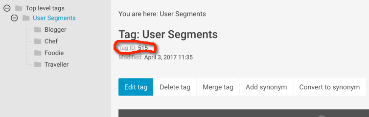
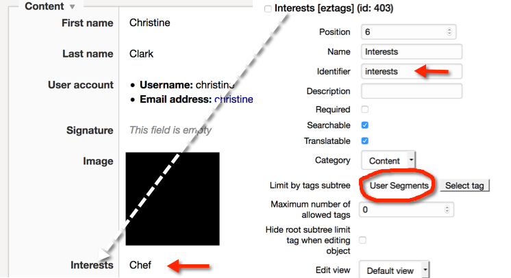

# EzUserProfilingBlockBundle
The EzUserProfilingBlockBundle allow you to personalize the content of the landingpage when using [**eZ Platform Enterprise Edition**](https://github.com/ezsystems/ezplatform-ee) for multiple user categories.

The code in this bundle belongs to the previous work in the "ezstudio-demo-bundle" . The user profiling code is the same but now available as bundle, so that it is now possible to use this bundle in different project 

## Prerequisites
* [**eZ Platform Enterprise Edition**](https://github.com/ezsystems/ezplatform-ee)
* [Netgen Tags Bundle](https://github.com/netgen/TagsBundle)

## Installation
1.Clone or download the bundle in your src/**Ez** folder

2.Add the bundle in _app/AppKernel.php_:
```php
// app/AppKernel.php

    public function registerBundles()
    {   
        $bundles = array(
        // ...
        new Ez\UserProfilingBlockBundle\EzUserProfilingBlockBundle(),
        // ...
    );
}
```
3.Add following route to app/config/routing.yml

```
ez_user_profiling_block:
    resource: "@EzUserProfilingBlockBundle/Resources/config/routing.yml"
    prefix:   /
```
4.Install web assets
```
php app/console assets:install --symlink --relative
```
5.Dumping Asset Files

```
php app/console assetic:dump 
```

6.Clear cache (production add : --env=prod)
```
php app/console cache:clear
```

## Settings
- Create "User Segments" keywords tree in the UI using the Netgen Tags Bundle.



- Change the _subtreeLimit_ value with the your Tag ID (see above image) in _Resources/public/js/views/up-itemsfieldview.js_ (~ Line 137) 

```
subtreeLimit: xx,
```

- Add new Tags FieldType to the user ContentType. The FieldType identifier **should be** added in services.yml using the _'user_interest_field_identifier'_ parameter.





### Template settings
- In config/ezdemo.yml you should add the ContentType that will be used and displayed later with the user profiling block (default:'product_item' and 'blog_post')

- In _Resources/views/block_item/product_item.html.twig_ the _content name_ and the _main_image_ fileds of the content will be displayed. Please adapt this template with your content fields. 

- In _Resources/views/user/preferences.html.twig_ change the first line to use your own pagelayout.(more infos in Usage 7.)

## Usage

1. Add one of the user segment keyword to your user
2. Add user profile block to your landingpage
3. Use the same keyword as above in your block
4. Choose the content that should be displayed when the user is logged in
5. Choose default content that should be displayed for other user or anonymous
6. Check your landingpage before and after the login

7. When user is logged you can try to call following frontend route:
```
/user/preferences
```
From hier you can change the user keywords

## Screenshots
See the doc folder